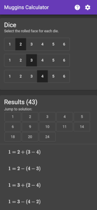
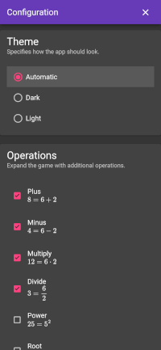

# Muggins Calculator  [](https://coveralls.io/github/vangorra/muggins_calculator)

Aa app for discovering and checking answers to the popular math board game Muggins.

[](https://vangorra.github.io/muggins_calculator/) [](https://vangorra.github.io/muggins_calculator/)

<a href="https://www.mugginsmath.com/" target="_blank">Muggins</a>
is an amusing and challenging board game for any group of people.
Calculating answers and learning how other obtained answers is revealing and educational.
The game gets more interesting when one expands the game with additional operation, dice and placement locations.
This app provides the assistance and validation to using the standard game or any expansion.

Features:

- Human-readable equations with proper formatting and symbols.
- Supports default settings with a board numbered 1 through 36, 3 dice (6 faces each) and 4 operations (plus, minus, multiply, divide).
- Expand the game-play with additional operations (power, root, and modulo).
- Adjustable board size (placement locations) to any range of positive numbers. 
- Customize the number of dice and the number of faces per die. 
- Fast calculations using background processing.

The app is free to use by clicking the link below.

https://vangorra.github.io/muggins_calculator/

## Development

To keep local and continuous integration builds consistent,
this application uses a Docker-ized development environment to facilitate development.
The container has everything the app needs to build, test and run.
Using the container reduces the dependency required to setup the build environment to 2 in total (Bash and Docker).

Note: Usage of the dev env is optional but encouraged.
Once can run all the commands below without `devenv.sh`.

### Setup

The application is written as an Angular project in Typescript.
It supports progressive web apps and does much of it's work in local service workers.

```shell
# Build the image for development.
# This step is optional as the exec command will build the image if needed.
./devenv.sh build
# Install the dependencies.
./devenv.sh exec npm install
# Serve the application.
./devenv.sh exec gulp serve
```

### Serve Locally

Watch for changes, rebuild and refresh the browser.
We are not using `ng serve` because is does not support progressive web app hosting.
Nevertheless, our hosting solution responds just as quickly to code changes.

```shell
# Prepares the entire application (without tests) and serves locally.
# The local URL to the app will be clearly presented after the first build completes.
./devenv.sh exec gulp serve
```

### Full Build

All changes are heavily format checked and tested.
Prior to any commit, one should run a full build to ensure code is properly linted, formatted, tested and built.

```shell
# Run full build will all formatting and testing.
./devenv.sh exec gulp buildFulll

# Run continuous integration build. This is intended to be ran by a build server.
# Does everything buildFull does except that this only checking code formatting 
# and throws an error as opposed to applying the changes. 
./devenv.sh exec gulp buildFullCi
```

### Unit Testing

The application contains extensive unit tests to ensure proper operation.
Unit tests are written using Jest but should be run through the `ng` command or through `gulp`.
Running unit tests directly with the `jest` command will result in weird output.
Coverage reports are available in `./build/coverage/jest/`

```shell
# Run through gulp.
./devenv.sh exec gulp unitTest

# Run unit tests through ng. This provides access to mode jest CLI options too.
# For example, you can run `ng test --watch --test-path-pattern '.*about-dialog.*'`
./devenv.sh exec ng test

```

### Integration Testing

The application utilizes full end-to-end tests provided through Playwright.
All tests can be run with `gulp` or directly with `playwright`.
Coverage reports are available in `./build/coverage/playwright/`

```shell
# Run all tests with gulp.
# If not already running, the application will be served with `gulp serve`, tested, 
# and stopped once tests complete.
./devenv.sh exec gulp endToEndTest

# Run all tests with playwright.
# If not already running, the application will be served with `gulp serve`, tested, 
# and stopped once tests complete.
./devenv.sh exec playwright test

# For a faster end-to-end experience, serve the application in one terminal
# and run the tests in another.
# This ensures the serve is always running and playwright will use the existing
# serve URL if it is avilable.
# Terminal 1
./devenv.sh exec gulp serve
# Terminal 2
./devenv.sh exec playwright test
```

### Notes

#### Calculator and Solver Code

As with most user oriented applications, 99% of the code here handles user experience and interaction.
The code that performs the actual calculations is located here.

- `src/app/solver/solver.ts` - Independent of the app and redistributable.
This file performs all the calculations.
- `src/app/solver/utils.ts` - Utils more specific to the app that group results by solution.

#### MathJax

This app uses Mathjax to format equations in a human friendly format.
The following describes how mathjax assets are stored.

- `package.json` - Added mathjax as a dependency.
- `angular.json` - Added build asset for the `mathjax/es5` directory.
This ensures we are serving the compiled version and never pulling remote resources at runtime.
- `src/app/math-jax` - An angular module, directive and service that supports using MathJax.
- `src/app/app.component.html` - Waits for the MathJax service to have finished initializing before showing the app.
This make initial and future renders of the directive fast and consistent.
